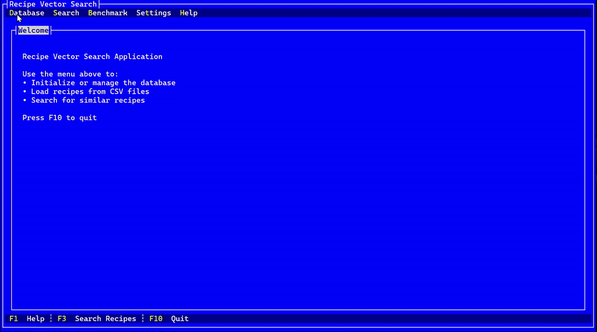

# 🍲 Recipe Vector Search TUI



A terminal-based user interface (TUI) for searching recipes using vector similarity based on BERT embeddings. This project allows you to manage a recipe database, embed recipe text using ONNX, and perform similarity search using vector embeddings — all from a cross-platform terminal UI powered by [Terminal.Gui](https://github.com/gui-cs/Terminal.Gui).

---

## ✨ Features

- Terminal GUI interface with menus, dialogs, progress bars, and benchmarking.
- Search for similar recipes using vector embeddings (MiniLM).
- PostgreSQL + [pgvector](https://github.com/pgvector/pgvector) as a vector database backend.
- ONNX Runtime support (CPU/GPU/NPU).
- Built-in benchmarking for embeddings throughput.
- Supports loading recipes from CSV.
- Uses BERT-based embedding model (`all-MiniLM-L6-v2`).

---

## 🚀 Getting Started

### 1. Clone this repository

```bash
git clone https://github.com/your-username/recipe-vector-search.git
cd recipe-vector-search
````

### 2. Download and Export the Embedding Model

This app requires an ONNX version of `sentence-transformers/all-MiniLM-L6-v2`.

You can export it using the [`optimum-cli`](https://huggingface.co/docs/optimum/cli/usage/export_onnx):

```bash
pip install optimum[onnxruntime]
optimum-cli export onnx --model sentence-transformers/all-MiniLM-L6-v2 minilm_onnx/
```

---

### 3. Prepare Your Database

Ensure PostgreSQL is installed with the `pgvector` extension enabled:

```sql
CREATE EXTENSION IF NOT EXISTS vector;
```

The app lets you:

* Initialize / reset / drop the database.
* Update connection strings interactively.

---

### 4. Load Recipes (Optional)

The included CSV file (`recipes.csv`) contains the first **1000 lines** of the [RecipeNLG dataset](https://github.com/iktina/RecipeNLG).

To access the **full dataset**, visit:

👉 [https://github.com/iktina/RecipeNLG](https://github.com/iktina/RecipeNLG)

Use the GUI to load the recipes into the database via the menu:

```
Database -> Load Recipes
```

---

## 📝 License

MIT License. Attribution appreciated if used in academic or derivative projects.

---

